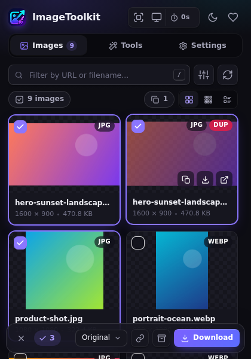
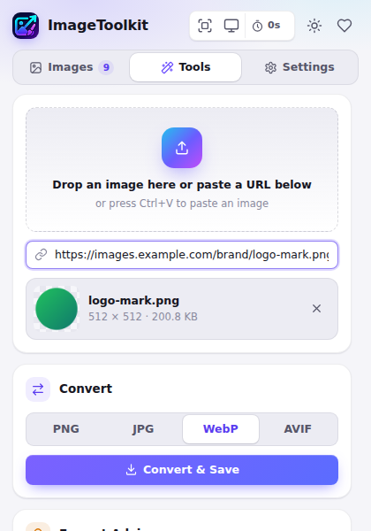
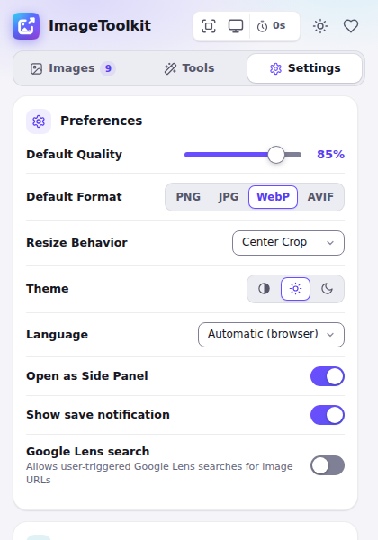
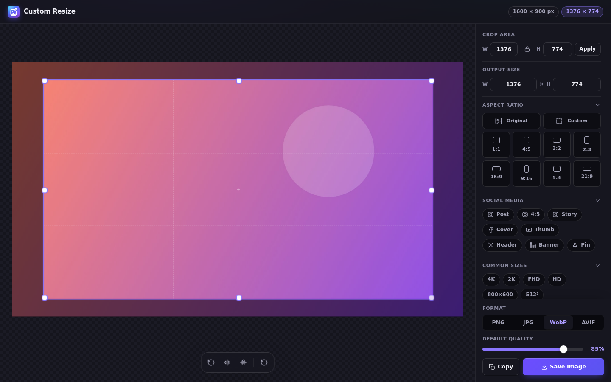

<h1 align="center">
  <picture>
    <source media="(prefers-color-scheme: dark)" srcset="docs/brand/lockup-dark.svg">
    
  </picture>
</h1>

> **The browser extension to find, save, convert, capture, crop and optimize images — 100% local, zero tracking.**

[](LICENSE)
[](https://developer.chrome.com/docs/extensions/mv3/)
[](https://github.com/BlackSpirits/ImageToolkit/actions/workflows/ci.yml)

---

## 🎨 Brand

The mark is a single continuous image frame that opens into an export arrow: find an image, work on it, take it with you. It sits on a cyan → indigo → violet tile, the same gradient the interface uses in its light, dark and automatic themes.

- Vector sources live in [`docs/brand`](docs/brand): `logo.svg` (128 px and up), `logo-medium.svg` (32 and 48 px: one solid mountain, no translucency or shadow), `logo-small.svg` (16 px: frame and arrow only) and the light/dark wordmark lockups.
- `npm run build:icons` renders every PNG in `icons/` from those sources, including the 128 px store icon with the 16 px padding the Chrome Web Store asks for.

## 📸 Screenshots

<p align="center">
  
  
  
</p>
<p align="center">
  
</p>

## ✨ Features

### 🔄 Format Conversion
Right-click any image and save it as **PNG**, **JPG**, **WebP** or **AVIF**. Transparent images get a white background when converting to JPG — no more black artifacts. Chrome cannot encode AVIF from a canvas yet, so AVIF requests fall back to WebP and the file is saved with a `.webp` extension: the extension always matches the real content.

### 📥 True "Original" Downloads
**Original** keeps the exact source bytes — GIF animation, SVG vectors and JPEG quality are preserved, and the file extension comes from the real content type, even when the URL has none.

### 🖼️ Image Grid
Browse every image on the current page in a fast grid, compact grid or list, with dimensions, file size and type. Search by URL, file name or alt text, and filter by **format**, **size range**, **shape** or **domain**. Hotlink-protected thumbnails are fetched through the extension so they still show. In the side panel, the grid follows the active tab and page loads automatically.

### ⌨️ Keyboard & Selection
- Shift-click selects a range, Ctrl/⌘-click toggles a single image
- Arrow keys move between images, **Enter** opens the preview, **Space** selects
- **/** focuses the search, **Ctrl/⌘ + A** selects everything visible, **Esc** clears
- In the preview, ← / → browse through the filtered images

### 📸 Screen Capture
Capture an **area** (with an optional 3/5/10-second delay) or the **visible page**, straight into the editor. Start it from the panel, by right-clicking the toolbar icon, or with the `Alt+Shift+S` shortcut (customizable in `chrome://extensions/shortcuts`).

### ✂️ Editor
Crop, rotate and flip with presets for aspect ratios, common resolutions, social networks (Instagram, Facebook, YouTube, X, LinkedIn, Pinterest), TMDB and TheTVDB. Pick the output size and format, then **Save** (`Ctrl/⌘ + S`) or **Copy** (`Ctrl/⌘ + C`) the result.

### 📋 Copy & Paste
Copy any image to the clipboard as PNG, ready to paste into Slack, Discord, Figma or any app. Paste an image (or an image URL) anywhere in the panel with **Ctrl/⌘ + V** to open it in Tools, or drag one in from a web page.

### 🧠 Format Advisor
Load an image in Tools and see how large it would be as PNG, JPG and WebP next to the original — with a recommendation that respects transparency.

### 🔁 Duplicate Detection
URL-based heuristic deduplication identifies likely duplicates (same path, different cache-busting params). Duplicates are flagged and can be hidden with one click. It is URL-based, not pixel-based.

### 📦 Batch Download
Select images and download them one by one (never one Save As dialog per image) or as a single ZIP, in their original format or converted. Copy all selected URLs in one click.

### ⚙️ Settings
- Default quality and format, resize behavior (center crop or fit/letterbox)
- Save As dialog, notifications, side panel or popup
- Subfolder, file name pattern (original, system or custom prefix), convert-on-download, ZIP by default
- Optional, off-by-default Google Lens search
- Auto / light / dark theme and 18 interface languages

### 🌍 Multilingual
18 languages, all fully translated (see [TRANSLATION_AUDIT.md](TRANSLATION_AUDIT.md)), with right-to-left layout for Arabic. The interface language can be overridden in Settings.

---

## 🔒 Privacy

- **Zero data collection** — all processing happens locally in your browser
- **No analytics, no tracking, no remote scripts** — everything is bundled
- **`host_permissions: <all_urls>`** — needed to scan pages and to fetch cross-origin images for conversion. Optional actions such as Google Lens only run when enabled and clicked.

See [PRIVACY.md](PRIVACY.md) for the full privacy policy.

---

## 🚀 Installation

### From Chrome Web Store
*(Coming soon)*

### Manual (Developer Mode)
1. Download or clone this repository
2. Open `chrome://extensions/`
3. Enable **Developer mode**
4. Click **Load unpacked**
5. Select the project folder

---

## 🏗️ Architecture

```
ImageToolkit/
├── manifest.json          MV3 manifest
├── background.js          Service worker: menus, commands, routing, downloads, capture, probing
├── offscreen.html/js      Canvas engine: conversion, resize, crop (+ clipboard fallback)
├── content.js             Image scanner (injected on demand)
├── capture.js             Area-selection overlay (injected on demand)
├── popup.html/css/js      Panel UI: Images, Tools, Settings (popup and side panel)
├── resize.html/css/js     Editor window (Cropper.js)
├── lib/
│   ├── core.js            Pure helpers shared by every context (and unit-tested)
│   ├── i18n.js            chrome.i18n-compatible language override
│   ├── ui.js / ui.css     Design tokens and shared UI components
│   ├── handoff.js         IndexedDB handoff of images between contexts
│   └── jszip / cropper    Bundled third-party libraries (MIT)
├── _locales/              18 language packs
├── tests/                 Unit (node:test) and end-to-end (Playwright) tests
└── scripts/               Validation and Web Store bundle build
```

### Design Decisions

- **Offscreen document** for canvas work — no code is injected into pages to convert images
- **On-demand scripts** — the scanner and the capture overlay are only injected when you use them, and the live observer stops after a few idle minutes
- **Least trust between contexts** — the service worker only accepts privileged messages from extension pages; content scripts can report captures and new images, nothing else
- **Real formats** — output names follow the format actually produced, and "Original" keeps the source bytes
- **Clipboard where there is focus** — the panel and editor write to the clipboard directly; context-menu copies are written from the page you right-clicked
- **Bounded work** — image size, canvas area, probe counts and probe downloads are capped
- **No frameworks** — plain JS/CSS, system fonts, one SVG icon sprite

---

## 🧪 Development

```bash
npm run validate   # manifest, file references, JS syntax, i18n parity/placeholders/usage
npm run check:contrast # WCAG AA for every text/background token pair, both themes
npm test           # unit tests (node:test, no dependencies)
npm run build      # dist/imagetoolkit-<version>.zip with runtime files only
npm run build:icons # re-render icons/*.png from docs/brand (needs Playwright Chromium)

npm ci && npx playwright install chromium
npm run test:e2e   # loads the extension in Chromium and drives real flows
```

CI runs all of the above on every pull request.

---

## 🤝 Contributing

Contributions are welcome! Please feel free to submit a Pull Request.

1. Fork the repository
2. Create your feature branch (`git checkout -b feature/amazing-feature`)
3. Run `npm run check` (and `npm run test:e2e` for UI changes)
4. Commit your changes and open a Pull Request

---

## 📄 License

This project is licensed under the **MIT License** — see [LICENSE](LICENSE) for details.

---

## 💖 Support

If you find this extension useful, consider supporting development:

[](https://ko-fi.com/blackspirits)

---

<p align="center">
  Made with ❤️ by <a href="https://blackspirits.github.io">BlackSpirits</a>
</p>
